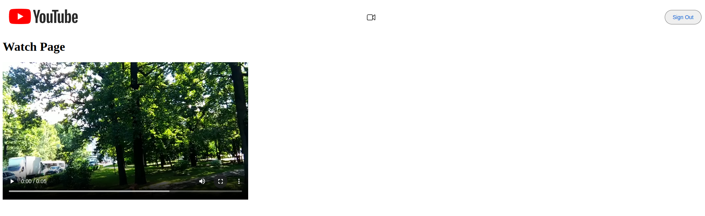
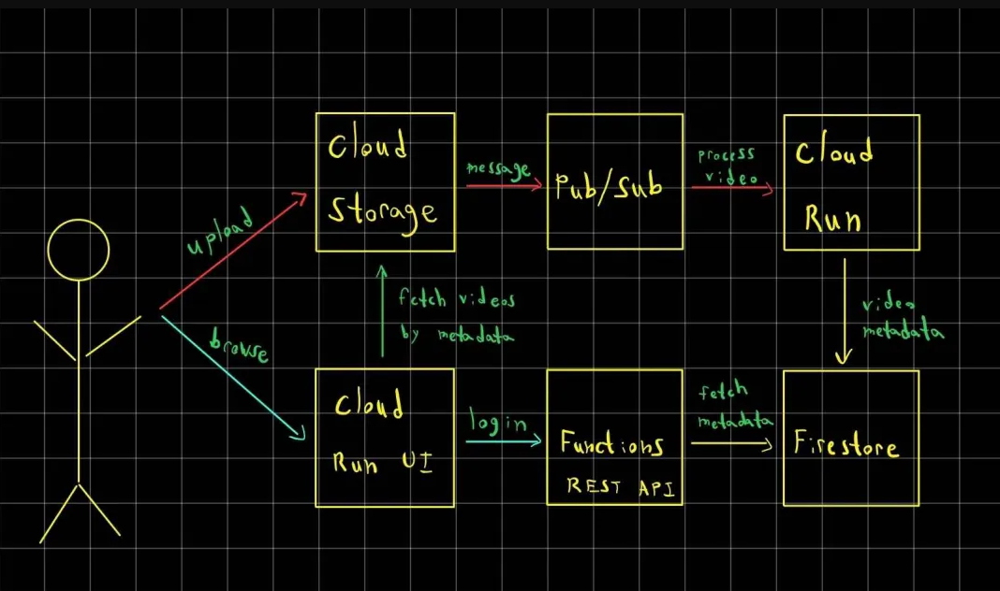

# YouTube Clone

# Youtube Clone

### UI

### Background

YouTube is a video sharing platform that allows users to upload, view, rate, share, and comment on videos. The scope of YouTube is very large, such that even "trivial" features like rating and commenting on videos are actually quite complex at this scale (1B+ daily active users). For this reason, I’ll be focusing mostly on uploading/viewing videos.

### Requirements

- Users can sign in/out using their Google account
- Users can upload videos while signed in
- Videos should be transcoded to multiple formats (e.g. 360p, 720p)
- Users can view a list of uploaded videos (signed in or not)
- Users can watch videos (signed in or not)

### Architecture Design

### Tech Stack

- TypeScript
- Next.js
- Express.js
- Docker
- FFmpeg
- Firebase Auth
- Firebase Functions
- Firebase Firestore
- Google Cloud Storage
- Google Cloud Pub/Sub
- Google Cloud Run

| **Component** | **Description** |
| --- | --- |
| **Video Storage (Cloud Storage)** | Google Cloud Storage will be used to host the raw and processed videos. This is a simple, scalable, and cost-effective solution for storing and serving large files. |
| **Video Upload Events (Cloud Pub/Sub)** | When a video is uploaded, we will publish a message to a Cloud Pub/Sub topic. This will add a durability layer for video upload events and enable asynchronous video processing. |
| **Video Processing Workers (Cloud Run)** | When a video upload event is published, a video processing worker will receive a message from Pub/Sub and transcode the video using `ffmpeg`, a popular open-source tool. Cloud Run will handle scaling based on workload. |
| **Video Metadata (Firestore)** | After a video is processed, we will store the metadata in Firestore. This allows us to display processed videos in the web client along with relevant information such as title and description. |
| **Video API (Firebase Functions)** | Firebase Functions will be used to build a simple API for uploading videos and retrieving video metadata. It can be extended to support additional Create, Read, Update, Delete (CRUD) operations. |
| **Web Client (Next.js / Cloud Run)** | We will use Next.js to build a web client that allows users to sign in and upload videos. The web client will be hosted on Cloud Run. |
| **Authentication (Firebase Auth)** | Firebase Auth will handle user authentication, making it easy to integrate with Google Sign-In. |

### Detailed Design

### User Sign Up

Users can sign up using their Google account and this is easily handled by Firebase Auth. A user record will be created including a unique auto-generated ID for the user, as well as the user's email address.

For us to include additional info about the user, we will create a Firestore document for each user, which will be a part of the `users` collection. This will allow us to store additional info about the user (e.g., name, profile picture, etc.).

### Video Upload

Ideally, we should only allow authenticated users to upload videos. This will allow us to associate the uploaded video with the user who uploaded it. In the future, this could also allow us to enforce quotas on video uploads (e.g., 10 videos per user a day).

While we could allow users to upload videos directly to a server we manage ourselves, it's simpler to use a service like Google Cloud Storage, which is specifically designed for arbitrarily large files like videos.

To prevent unauthorized users from uploading videos, we will generate a signed URL that will allow the user to upload a video directly to Cloud Storage.

### Video Processing

We'd like to process videos as soon as they come in, but it's possible that we could receive a large number of uploads at once which we can't immediately process. To solve this problem, we will introduce a message queue to our system - Cloud Pub/Sub.

This provides many benefits:

- When a video is uploaded to Cloud Storage, we can publish a message to a Pub/Sub topic. This will allow us to decouple the video upload from the video processing.
- We will use Pub/Sub subscriptions to push messages to our video processing workers.

After a video is processed, we will upload it to a public Cloud Storage bucket. We will also store the video metadata in Firestore, including the video's processing status. This will allow us to display the processed videos in the web client.

### **References**

Firebase Auth: [https://firebase.google.com/docs/auth](https://firebase.google.com/docs/auth)

Cloud Storage Signed URLs: [https://cloud.google.com/storage/docs/access-control/signed-urls](https://cloud.google.com/storage/docs/access-control/signed-urls)

Pub/Sub Push subscriptions: [https://cloud.google.com/pubsub/docs/push](https://cloud.google.com/pubsub/docs/push)

Using Pub/Sub with Cloud Storage: [https://cloud.google.com/storage/docs/pubsub-notifications](https://cloud.google.com/storage/docs/pubsub-notifications)

Using Pub/Sub with Cloud Run: [https://cloud.google.com/run/docs/tutorials/pubsub](https://cloud.google.com/run/docs/tutorials/pubsub)
